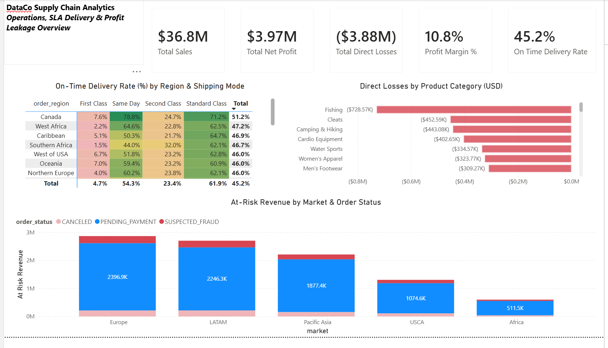

# 📦 DataCo Global Supply Chain Analytics & Margin Optimization

[](https://www.mysql.com/)
[](https://powerbi.microsoft.com/)
[](LICENSE)

---

## Executive Summary
An end-to-end supply chain diagnostic analyzing **180,519 order transactions** from DataCo Global. Combining database engineering in **MySQL** with DAX modeling in **Power BI**, this analysis isolates root operational causes behind **$3.88M in direct margin losses** and **$8.2M+ in at-risk revenue**.



### 📁 Project Documentation & Assets
* 📄 **SQL Engineering & Validation Report:** [View Dataco - SQL.pdf](Dataco%20-%20SQL.pdf)
* 📐 **DAX Formulas & Metric Reference:** [View DAX Queries Reference.pdf](DAX%20Queris.pdf)
* 📊 **Interactive Dashboard:** [Download Power BI File (.pbix)](DataCo%20Supply%20Chain%20Analytics%20-%20Akmal.pbix)

---

## 🎯 Core Business Problem Statement
While DataCo recorded **$36.78M in gross sales** and **$3.97M in net profit (10.8% margin)**, deep-dive diagnostics revealed three major operational vulnerabilities:

1. **Logistics SLA Failure:** Overall on-time delivery rate is suppressed at **45.2%**, driven by severe fulfillment delivery gaps in premium tiers.
2. **Promotional Margin Erosion:** Systematic discounting across high-volume sporting goods generated **$3.88M in negative-profit orders**.
3. **Checkout & Fulfillment Friction:** International payment drop-offs and order cancellations trap **$8.2M+ in unrealized pipeline revenue**.

---

## 🛠️ Data Architecture & Workflow

[Kaggle Raw Dataset]
│ (180,519 Rows / 53 Columns)
▼
[MySQL Data Cleaning & Transformation]
│ • Schema optimization & datetime parsing (STR_TO_DATE)
│ • Derived operational flags (lead_time_variance_days, is_loss_making_order)
│ • Production analytical view: vw_supply_chain_clean
▼
[Batch Extraction & Power Query Ingestion]
│ • Executed segmented batch exports (0–90k & 90k–180.5k rows)
│ • Consolidated 180,519 records via Power Query folder integration
▼
[DAX Semantic Modeling & KPI Engine]
│ • Context-isolated _Measures table
│ • Dynamic margin, OTDR, and risk loss formulas
▼
[Executive Decision Dashboard]

---

## 📊 Core Business Insights & Findings

### 1. SLA Delivery Performance & Logistics Breakdown (Matrix Heatmap)
* **Metric:** On-Time Delivery Rate (`45.2%` global average).
* **Key Finding:** **First Class shipping is an operational failure**, averaging a **4.7% on-time delivery rate** globally.
* **Root Cause:** Customer promise dates set a strict 1-day delivery window, while actual carrier fulfillment requires a minimum of 2 days.

### 2. Profit Leakage & Discount Erosion (Clustered Bar Chart)
* **Metric:** Total Direct Losses (`-$3.88M`).
* **Key Finding:** Losses are heavily concentrated in high-volume product categories:
  * **Fishing:** `-$728.57K`
  * **Cleats:** `-$452.59K`
  * **Camping & Hiking:** `-$443.08K`
  * **Cardio Equipment:** `-$402.65K`
* **Root Cause:** A flat ~18.5% to 19.6% loss rate per order driven by uncapped promotional discount stacking and unabsorbed shipping fees on bulky items.

### 3. Global Revenue at Risk (Stacked Column Chart)
* **Metric:** Trapped Pipeline Revenue (`$8.2M+`).
* **Key Finding:** Friction is concentrated in **Europe ($2.65M at risk)** and **LATAM ($2.50M at risk)**, with **`PENDING_PAYMENT`** representing over 85% of trapped volume.
* **Root Cause:** Payment gateway drop-offs, unsupported cross-border settlement methods, and delayed credit authorization cycles.

---

## 💡 Strategic Recommendations

| Focus Area | Operational Recommendation | Projected Business Impact |
| :--- | :--- | :--- |
| **Logistics SLA** | Re-align customer checkout delivery estimates from 1 day to 2–3 days for First Class, or renegotiate carrier fulfillment SLAs. | Eliminates systemic SLA breaches and mitigates customer churn/refunds. |
| **Margin Control** | Introduce a strict 15% discount cap on high-shipping-cost categories (Fishing, Cleats). | Recovers an estimated **$1.2M–$2.0M** in eroded net margin. |
| **Payment Optimization** | Integrate localized European/LATAM payment gateways (e.g., iDEAL, Boleto) and implement automated checkout recovery notifications. | Recaptures up to **$3.0M+** in delayed checkout pipeline revenue. |

---

## 💻 Core DAX Formulas

```dax
// On-Time Delivery Rate %
On Time Delivery Rate % = 
VAR TotalOrders = COUNT(DataCo_Split[order_id])
VAR OnTimeOrders = CALCULATE(COUNT(DataCo_Split[order_id]), DataCo_Split[late_delivery_risk] = 0)
RETURN DIVIDE(OnTimeOrders, TotalOrders, 0)

// Direct Loss Calculation
Total Direct Losses = 
CALCULATE(
    SUM(DataCo_Split[net_profit_usd]), 
    DataCo_Split[net_profit_usd] < 0
)

// Revenue at Risk Calculation
At Risk Revenue = 
CALCULATE(
    SUM(DataCo_Split[gross_sales_usd]), 
    KEEPFILTERS(DataCo_Split[order_status] IN {"PENDING_PAYMENT", "CANCELED", "SUSPECTED_FRAUD"})
)
